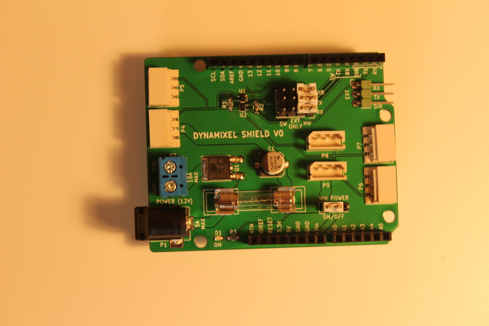
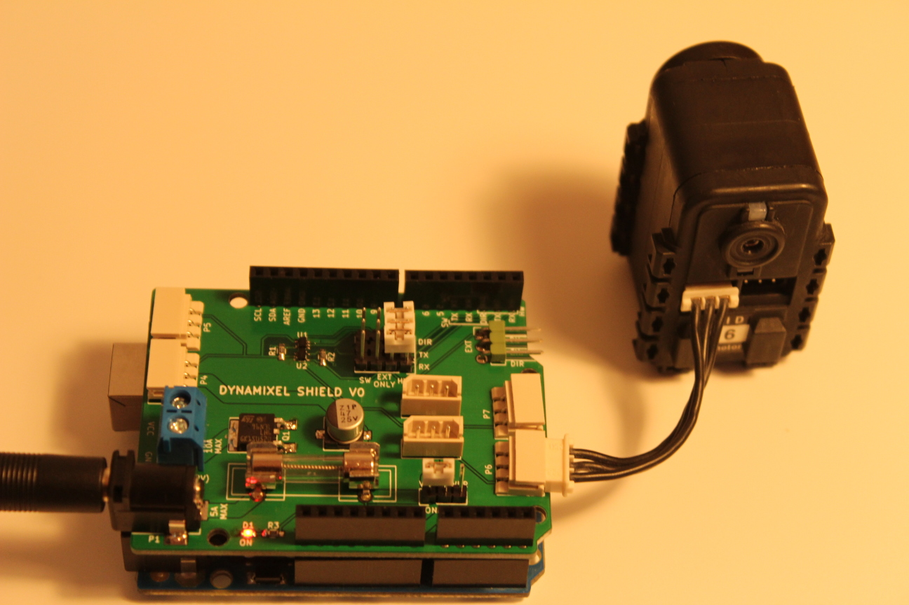

# Dynamixel shield




## What is it?

This is an arduino shield to control dynamixel servo motors from Robotis. AX and MX series (TTL version) are supported. Thanks to their half-duplex serial control protocol, you can chain them and control a lot of motor simultaneously (up to 254 in theory). It is possible to control those motors with an arduino without additionnal hardware, but this board makes it easier and cleaner.

## How to use it?

### Hello world (aka blink my led)

First install the [ardyno](https://github.com/descampsa/ardyno/) library, using the Arduino Library Manager, or directly from the github repository.
Then open the "test_led" example and upload it. The shield can not be installed when you install the program.
Install the shield, check that the jumpers are on 'HW' position, connect the motor and a 12v power supply, and voila, the motor "led" should start blinking!
To get the motor moving (that's the point, after all), check the "test_motor" exemple. The documentation is still lacking, but by browsing examples and code, you should be able to do understand how it works. If you have any question, just ask.

### Software serial

The default mode explained above is to use the first hardware UART (Serial) of the board to communicate with the motors. This has the advantage that you can usethe full communication speed (up to 2Mbaud, by default 1Mbaud) of the protocol. However, boards that only have one hardaware uart (e.g. Uno), that means that you can't simultaneously use the USB port to communicate with the external world, since it also uses this UART. If you want to do that, you have to use the SoftwareSerial mode. The disadvantage is that you are limited to low baud rates (check the SoftwareSerial library documentation). You will have to change the baud rate of the motor using the hardware serial before (see "test_speed" example).

To use the SoftwareSerial mode, change the jumper to 'SW' position, and replace the line
```
HardwareDynamixelInterface interface(Serial,2);
```
by

```
SoftwareDynamixelInterface interface(4,3,2);
```

The first version take the hardware serial instance, and the direction pin as parameters, while the second one take rx pin, tx pin and direction pin.

### Other Hardware Serial

For boards that have multiple hardware uart, you may use any of those ports by connecting the corresponding pins to the 'EXT' connector. Just set the jumper to 'EXT ONLY' position, and connect RX/TX/DIR pins to the rx/tx pins of the uart and the direction pin configured in your code.

## Which boards are compatible?

Most of the code is platform independent, but it has only been tested with AVR boards. If you want to use another platform and find a bug, open an issue in ardyno repository.
The shield supports both 5V and 3.3V boards.

I also successfully tested it with the Arduino 101, but there are still a few shortcomings in the serial libray of this board, so this is experimental.

## Great, how do i get one?

The good news is that all is open source, the kicad project, gerber file, code, bom, all you need to make your own. Gerber and bom are also available on [kitnic](kitnic.it), where you may order the parts very easily. The bad news is that you can't buy one, i do not sell it for now.
I have a few unpopulated pcb left, however, so if you are interested, just ask and i will send you one for shipping cost.


## Warning

This board is functionnal, but has not yet been tested extensively, especially for high loads. Make sure you know what you are doing if you use it.
